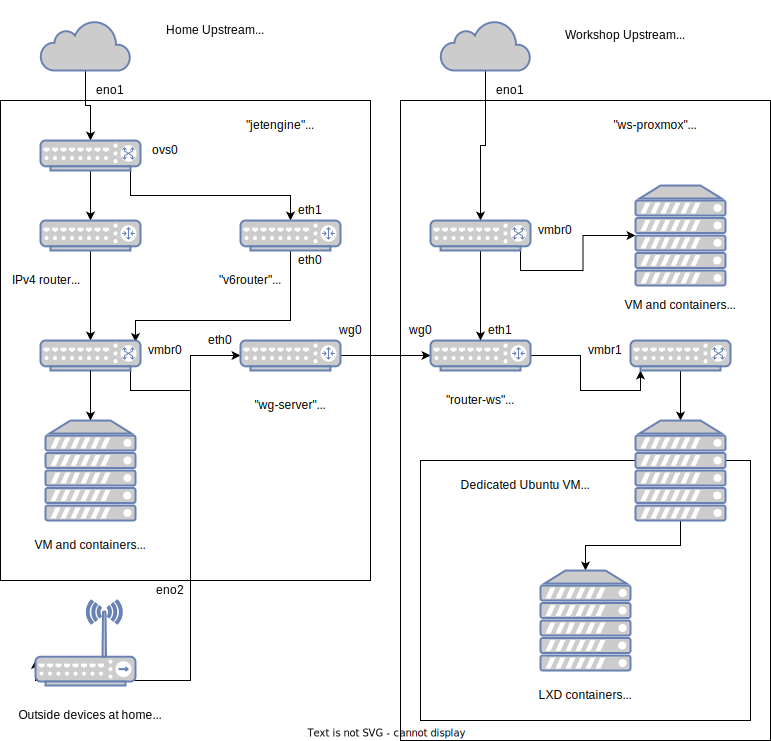

# Bringing global IPv6 to a network with OpenWrt and Wireguard

Or, *Redoing my lab network for one last time*



Craig Miller's ["Wireguard IPv6 VPN"](http://www.makikiweb.com/ipv6/wireguard_on_openwrt.html) introduced to me the stacked interface trick. This single-handedly solved the problem of pushing IPv6 addresses over the WireGuard tunnel. This also replaced IPv6 routing protocols with simple Router Advertisements. Thank you!

My home Internet connection comes with a public /56 IPv6 prefix. This is incredibly useful in running projects and hosting stuff on my home server. On the other hand, another server in my workshop is cursed by NAT and IPv4-only Internet. I spent the last 2 days connecting the two servers together, trying to make everything available over IPv6.

### The setup
My home server is a HP 1U, aptly named `jetengine`. It runs Proxmox. Home internet comes in through `eno1` and the bridge `ovs0`. Dnsmasq and iptables forwarding runs on the server to provide IPv4 connectivity to devices attached. This server also serves as my home router, with a wireless AP connected through `eno2`.

My workshop server is a SuperMicro 2U named `ws-proxmox`. It also runs Proxmox. Workshop internet comes in through `eno1`. VM's and containers used in the workshop are directly bridged. I have a Ubuntu VM attached for my old containers running on LXD. I managed to break the upstream once by directly bridging the LXD containers. I depleted the address pool as upstream DHCP server remembers MAC to IPv4 assignments permanently. After that incident I used LXD's NAT function to keep my address usage in control.

### Only OpenWrt works
The DHCPv6 client `dhclient` bundled with Debian does not work with my home internet. I tracked that down to upstream only using SLAAC but not DHCPv6 to assign addresses. DHCPv6 is only used to assign prefixes. Strangely enough OpenWrt's `odhcpd` works perfectly. I decided to use OpenWrt on all new routers I am adding this time.

It takes some time to get used to OpenWrt's config files. It ultimately boils down to these few files:
* `/etc/config/network` is for network devices and addressing. Run `/etc/init.d/networking restart` to apply changes. [Reference](https://openwrt.org/docs/guide-user/base-system/basic-networking)
* `/etc/config/dhcp` is for DHCP server. I do not remember changing this file much. Probably I used the web UI instead. [Reference](https://openwrt.org/docs/guide-user/base-system/dhcp)
* `/etc/config/firewall` is for forwarding rules. Run `/etc/init.d/firewall restart` to apply changes. [Reference](https://openwrt.org/docs/guide-user/firewall/firewall_configuration)

These pages from the OpenWrt user guide are also useful:
* [IPv6 configuration](https://openwrt.org/docs/guide-user/network/ipv6/configuration)
* [WireGuard server](https://openwrt.org/docs/guide-user/services/vpn/wireguard/server)
* [WireGuard client](https://openwrt.org/docs/guide-user/services/vpn/wireguard/client)

### Adding routers

I assigned 4 CPU cores and 1GB RAM to each router VM. This is probably enough for processing at 1 Gbps. I did not test the performance limits for now.

I put 2 network interfaces on each VM. "net0" on Proxmox corresponds to "eth0" on OpenWrt. "eth0" is the default LAN interface while "eth1" is for WAN. I disabled Proxmox firewall on all interfaces. You can lock it down at the end after verifying everything works. I decide to rely on OpenWrt's firewalling instead. 

I disconnected all network interfaces (`link_down=1`) to the router in Proxmox. Just in case the new router tries to send DHCP or RA on the network.

I also put a serial port on so I can manage the router when the network goes wrong. (Which is almost always)

OpenWrt's official x86-64 image runs perfectly on Proxmox VM's. I downloaded "generic-ext4-combined.img.gz" and extracted the image as the boot drive at "scsi0" for each VM. The image is only 128MB big so make a few more copies if needed.

### First run
Take "v6router" on "jetengine" as an example.

Check the VM's Proxmox VMID. This can be done on the web UI or command line:
```
jetengine:~# qm list

(Look for the router's VMID)
(In my case it's 108)
```

Start the VM and attach to its serial terminal.
```
jetengine:~# qm start 108
jetengine:~# qm term 108

(Grub bootloader)
(Press enter if you do not want to wait 5 seconds)

(Linux boot messages)
```

After the boot message dies down, press `Enter` to get into the shell on the router.
```
*Enter*

BusyBox v1.33.2 (2022-02-16 20:29:10 UTC) built-in shell (ash)

  _______                     ________        __
 |       |.-----.-----.-----.|  |  |  |.----.|  |_
 |   -   ||  _  |  -__|     ||  |  |  ||   _||   _|
 |_______||   __|_____|__|__||________||__|  |____|
          |__| W I R E L E S S   F R E E D O M
 -----------------------------------------------------
 OpenWrt 21.02.2, r16495-bf0c965af0
 -----------------------------------------------------
=== WARNING! =====================================
There is no root password defined on this device!
Use the "passwd" command to set up a new password
in order to prevent unauthorized SSH logins.
--------------------------------------------------
root@v6router:/#
```

Press Ctrl+O to exit the terminal.

#### Change hostname
The default hostname is always "OpenWrt". Something weird may happen if there are multiple devices with the same hostname. Change hostname in `/etc/config/system` and then reboot.

#### Lock down SSH
The OpenWrt image has **SSH turned on and no root password set**. You msut either set up a new password or use public-key authentication instead. I choose to use public-key.
```
root@v6router:/# cat /etc/config/dropbear
config dropbear
        option PasswordAuth 'on'
        option RootPasswordAuth 'on'
        option Port         '22'
#       option BannerFile   '/etc/banner'
```
Change `PasswordAuth` and `RootPasswordAuth` to 'off'. Then copy your public key into `/etc/dropbear/authorized_keys`.
```
root@v6router:/# cat /etc/dropbear/authorized_keys
ssh-ed25519 AAAAC3NzaC1lZDI1NTE5AAAA(redacted)
```
Then run `/etc/init.d/dropbear restart`.

#### Access web UI over SSH
Sometimes it is better to work with the web UI. I found the most stable way to SSH into the router is through any of its IPv6 link-local address. The Proxmox server itself, with a stable Internet connection, can be used as a jump host.
```
(On my PC)
$ cat ~/.ssh/config

Host pve-home
  HostName (Home IP)
  Port (Home Port)

Host v6router-home
  User root
  HostName fe80::2468:41ff:c233:3d32%%vmbr0
  ProxyJump pve-home
  LocalForward 8443 localhost:443
```
The % in `HostName` needs to be escaped. The `LocalForward` line forwards the web UI on HTTPS to the local device. Visit `https://localhost:8443` to access it. Of course this device's public key needs to be copied to the router through the serial port first.


### Set up v6router
*Remember - No IPv4*

In Proxmox, connect net1 to home upstream bridge and net0 to home local bridge.

Delete 'wan' interface to disable IPv4 DHCP client. Set 'ip6assign' to anything smaller than 62. A /62 is the minimum for the Wireguard part to work.
```
root@v6router:/# cat /etc/config/network

config interface 'loopback'
        option device 'lo'
        option proto 'static'
        option ipaddr '127.0.0.1'
        option netmask '255.0.0.0'

config globals 'globals'
        option ula_prefix 'fdb2:b2b2:b2b2::/48'

config device
        option name 'br-lan'
        option type 'bridge'
        list ports 'eth0'

config interface 'lan'
        option device 'br-lan'
        option proto 'static'
        option ip6assign '62'

config interface 'wan6'
        option device 'eth1'
        option proto 'dhcpv6'
```

Change the firewall settings to this. Note the two forwarding stanzas. 'forward' in 'lan' zone needs to be ACCEPT.
```
root@v6router:/# cat /etc/config/firewall

config defaults
        option input 'ACCEPT'
        option output 'ACCEPT'
        option synflood_protect '1'
        option forward 'REJECT'

config zone
        option name 'lan'
        list network 'lan'
        option input 'ACCEPT'
        option output 'ACCEPT'
        option forward 'ACCEPT'

config zone
        option name 'wan'
        list network 'wan6'
        option input 'REJECT'
        option output 'ACCEPT'
        option mtu_fix '1'
        option forward 'REJECT'

config forwarding
        option src 'lan'
        option dest 'wan'

config forwarding
        option src 'wan'
        option dest 'lan'
```

Reconnect network through Proxmox web UI if it is disconnected. Run `/etc/init.d/network restart`. See if IPv6 works on this router.
```
root@v6router:/# ip -6 a show scope global
3: eth1: <BROADCAST,MULTICAST,UP,LOWER_UP> mtu 1500 state UP qlen 1000
    inet6 (redacted upstream IPv6 global IP)/64 scope global dynamic noprefixroute
       valid_lft 1779sec preferred_lft 1779sec
5: br-lan: <BROADCAST,MULTICAST,UP,LOWER_UP> mtu 1500 state UP qlen 1000
    inet6 (redacted delegated IPv6 prefix)::1/62 scope global dynamic noprefixroute
       valid_lft 1208sec preferred_lft 1208sec
    inet6 fdb2:b2b2:b2b2::1/62 scope global noprefixroute
       valid_lft forever preferred_lft forever
root@v6router:/# ifstatus wan6
(a big JSON showing addresses and prefixes)
(This is the same data as shown on the web UI)
root@v6router:/# ping -6 -c4 one.one.one.one
PING one.one.one.one (2606:4700:4700::1111): 56 data bytes
64 bytes from 2606:4700:4700::1111: seq=0 ttl=54 time=52.479 ms
64 bytes from 2606:4700:4700::1111: seq=1 ttl=54 time=52.609 ms
64 bytes from 2606:4700:4700::1111: seq=2 ttl=54 time=52.303 ms
64 bytes from 2606:4700:4700::1111: seq=3 ttl=54 time=53.275 ms

--- one.one.one.one ping statistics ---
4 packets transmitted, 4 packets received, 0% packet loss
round-trip min/avg/max = 52.303/52.666/53.275 ms
```

Install some useful utilities for troubleshooting if you like.
```
# opkg update
# opkg install tcpdump mtr curl
```

### Set up wg-server
This server will work with only one interface. Connect net0 to home local bridge and leave net1 unconnected.

Change the DHCPv6 client to request a prefix of at least /62. The WireGuard interface must have a IPv4 private address and a IPv6 link-local address.

This /30 network is only for the two endpoints of the tunnel. /31 does not work. 

I used the peer's public key to make a IPv6 link-local address. Something like `cat wg_pubkey | base64 -d | xxd` and taking the first 16 bytes will work.

Make router advertisement available over the WireGuard tunnel by stacking a static interface on top of it. This is the key to making the whole thing work. Let the static interface get a /63 to delegate prefixes. Only one /64 will be taken by the other end but setting 'ip6assign' to '64' here does not work.
```
root@wg-server:~# cat /etc/config/network

config interface 'loopback'
        option device 'lo'
        option proto 'static'
        option ipaddr '127.0.0.1'
        option netmask '255.0.0.0'

config globals 'globals'
        option ula_prefix 'fda9:a9a9:a9a9::/48'

config interface 'homev4'
        option device 'eth0'
        option proto 'dhcp'

config interface 'homev6'
        option device 'eth0'
        option proto 'dhcpv6'
        option reqaddress 'try'
        option reqprefix '62'

config interface 'wg0'
        option proto 'wireguard'
        option private_key '(redacted home wg0 private key)'
        option listen_port '51820'
        list addresses 'fe80::1e1e:1e1e:1e1e:1e1e/64'
        list addresses '10.11.0.1/30'

config wireguard_wg0 'wgclient'
        option public_key '(redacted workshop wg0 public key)'
        list allowed_ips '0.0.0.0/0'
        list allowed_ips '::/0'
        option description 'Workshop'
        option persistent_keepalive '10'

config interface 'wg0dhcp'
        option proto 'static'
        option device 'wg0'
        option ip6assign '63'
```
I simply allowed everything on this device's firewall. It's probably a good idea to see how to lock this down.
```
root@wg-server:~# cat /etc/config/firewall

config defaults
        option input 'ACCEPT'
        option output 'ACCEPT'
        option synflood_protect '1'
        option forward 'ACCEPT'

config include
        option path '/etc/firewall.user'

config zone
        option name 'home'
        option input 'ACCEPT'
        option output 'ACCEPT'
        list network 'homev4'
        list network 'homev6'
        option forward 'ACCEPT'

config zone
        option name 'workshop'
        option input 'ACCEPT'
        option output 'ACCEPT'
        list network 'wg0'
        list network 'wg0dhcp'
        option forward 'ACCEPT'

config forwarding
        option src 'home'
        option dest 'workshop'

config forwarding
        option src 'workshop'
        option dest 'home'
```
Check IPv4 and IPv6 connectivity after setting up the firewall.
```
root@wg-server:~# ping -c4 1.1.1.1
PING 1.1.1.1 (1.1.1.1): 56 data bytes
64 bytes from 1.1.1.1: seq=0 ttl=58 time=3.505 ms
64 bytes from 1.1.1.1: seq=1 ttl=58 time=3.753 ms
64 bytes from 1.1.1.1: seq=2 ttl=58 time=3.228 ms
64 bytes from 1.1.1.1: seq=3 ttl=58 time=3.211 ms

--- 1.1.1.1 ping statistics ---
4 packets transmitted, 4 packets received, 0% packet loss
round-trip min/avg/max = 3.211/3.424/3.753 ms
root@wg-server:~# ping -c4 -6 one.one.one.one
PING one.one.one.one (2606:4700:4700::1001): 56 data bytes
64 bytes from 2606:4700:4700::1001: seq=0 ttl=53 time=56.384 ms
64 bytes from 2606:4700:4700::1001: seq=1 ttl=53 time=57.089 ms
64 bytes from 2606:4700:4700::1001: seq=2 ttl=53 time=55.646 ms
64 bytes from 2606:4700:4700::1001: seq=3 ttl=53 time=58.923 ms

--- one.one.one.one ping statistics ---
4 packets transmitted, 4 packets received, 0% packet loss
round-trip min/avg/max = 55.646/57.010/58.923 ms
```

IPv6 routing is done by Router Advertisements but IPv4 routing is still to be done. I used "bird2" routing daemon to exchange routes with the other end over BGP.
```
# opkg update
# opkg install tcpdump mtr curl bird2 bird2c
```
bird2's config file is `/etc/bird.conf`. Delete the default file and replace with the following. The "IPv4 to home proxmox" BGP session is for sending back routes to the existing IPv4 router on Proxmox.
```
log syslog all;

protocol device {
}

protocol direct {
    ipv4;
}

protocol kernel {
        ipv4 {
                export filter {
                        if source = RTS_BGP then accept;
                        reject;
                };
        };
        learn;
        scan time 10;
}

protocol bgp {
        description "IPv4 to home Proxmox";
        local as 65011;
        neighbor 10.10.0.1 as 65010;
        ipv4 {
                import all;
                export all;
        };
}

protocol bgp {
        description "IPv4 to Workshop";
        local 10.11.0.1 as 655011;
        neighbor 10.11.0.2 as 65012;
        ipv4 {
                import all;
                export all;
        };
}
```
Let bird2 reload the config file.
```
root@wg-server:~# birdc
BIRD 2.0.8 ready.
bird> config
Reading configuration from /etc/bird.conf
Reconfigured
bird> restart all
device1: restarted
direct1: restarted
kernel1: restarted
bgp1: restarted
bgp2: restarted
bird> show p
Name       Proto      Table      State  Since         Info
device1    Device     ---        up     09:45:07.528
direct1    Direct     ---        up     09:45:07.529
kernel1    Kernel     master4    up     09:45:07.529
bgp1       BGP        ---        up     09:45:11.621  Established
bgp2       BGP        ---        up     09:45:11.544  Established
bird> show r
Table master4:
0.0.0.0/0            unicast [bgp1 09:45:11.621] * (100) [AS65010i]
        via 10.10.0.1 on eth0
                     unicast [kernel1 09:45:07.529] (10)
        via 10.10.0.1 on eth0
10.10.0.0/24        unicast [direct1 09:45:07.529] * (240)
        dev eth0
                     unicast [bgp1 09:45:11.621] (100) [AS65010i]
        via 10.10.0.1 on eth0
10.12.0.0/24        unicast [bgp2 09:45:11.627] * (100) [AS65012i]
        via 10.11.0.2 on wg0
10.11.0.0/30        unicast [direct1 09:45:07.529] * (240)
        dev wg0
                     unicast [bgp2 09:45:11.627] (100) [AS65012i]
        via 10.11.0.2 on wg0
```
### Set up router-ws
The config is similar to wg-server as both IPv4 and IPv6 connectivity is needed. Connect net0 to workshop local bridge and net1 to workshop upstream bridge.

Note 'lan' is set to distribute a /64 only. IPv6 link local address for the tunnel is attached to itself. IPv4 private addresses are attached to 'wg0v4' interface stacked on the tunnel. Other IPv6 addresses are received by a DHCPv6 interface 'wg0ip' stacked on the tunnel. Note only a /64 prefix is requested in the DHCPv6 client.
```
root@gaudat-router-fot1:~# cat /etc/config/network

config interface 'loopback'
        option device 'lo'
        option proto 'static'
        option ipaddr '127.0.0.1'
        option netmask '255.0.0.0'

config globals 'globals'
        option ula_prefix 'fdb3:b3b3:b3b3::/48'

config device
        option name 'br-lan'
        option type 'bridge'
        list ports 'eth0'

config interface 'lan'
        option device 'br-lan'
        option proto 'static'
        option ipaddr '10.12.0.1'
        option netmask '255.255.255.0'
        option ip6assign '64'

config interface 'wan'
        option device 'eth1'
        option proto 'dhcp'

config interface 'wg0'
        option proto 'wireguard'
        option private_key '(redacted workshop wg0 private key)'
        list addresses 'fe80::b0b0:b0b0:b0b0:b0b0/64'

config wireguard_wg0 'wgserver'
        option public_key '(redacted home wg0 public key)'
        option endpoint_host '(Home external IPv4)'
        option endpoint_port '51820'
        option persistent_keepalive '10'
        list allowed_ips '0.0.0.0/0'
        list allowed_ips '::/0'

config interface 'wg0ip'
        option device 'wg0'
        option proto 'dhcpv6'
        option reqaddress 'try'
        option reqprefix '64'

config interface 'wg0v4'
        option proto 'static'
        option device 'wg0'
        option ipaddr '10.11.0.2'
        option netmask '255.255.255.252'
```
