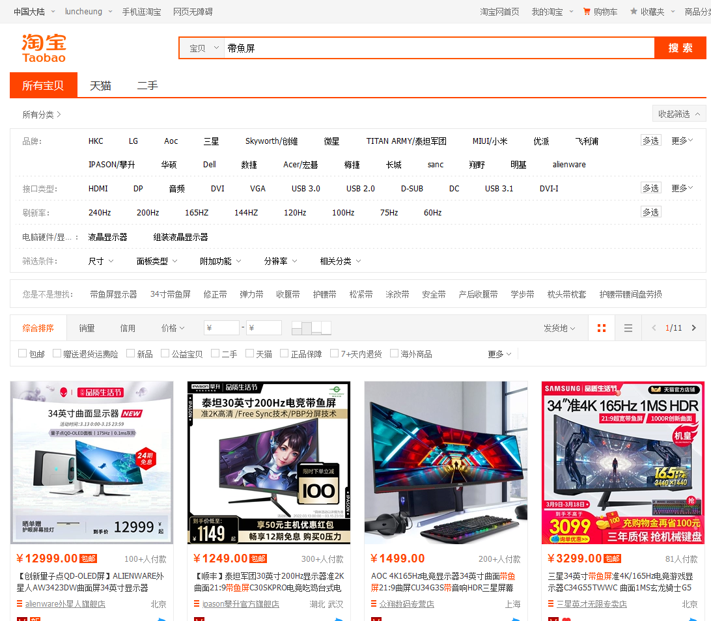
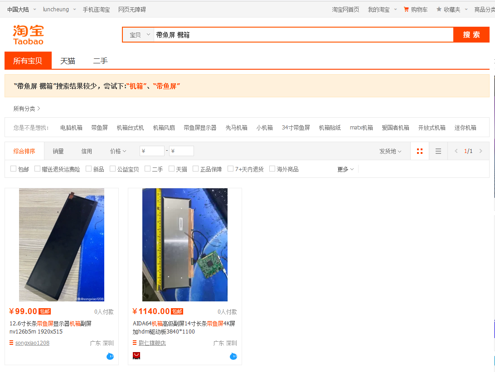
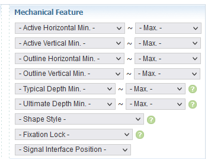
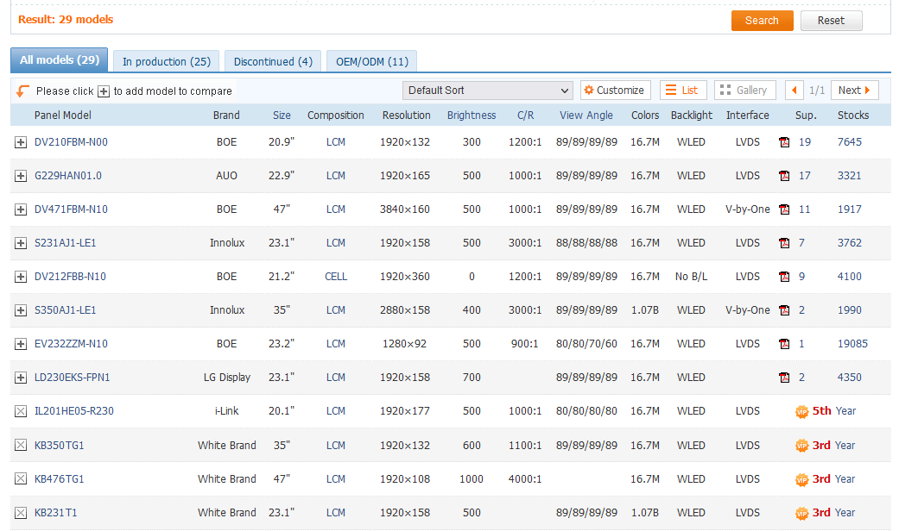

Main repository: https://github.com/gaudat/rlstatusbar

# Real-Life Status Bar

### Motivation
I was debugging stuff in the office. Got fed up that the logs only have an UNIX timestamp only. Decided I need a big clock showing UNIX time. One real clock instead of a web page wasting my screen area.

#### Ways to make it work
In a previous internship I made a **chainable 7-segment display** with some LED drivers and shift registers. Or maybe grab some **nixie tubes** make a divergence meter style thing. These are good enough for showing time for sure. But can we go further?

Maybe a **RGB LED panel** for those big displays? I have worked with these before but those only come in 1x1 or 1x2 aspect ratios. It will be weird to use these. Why not use a real LCD display that way?

And indeed a **LCD display** with the right aspect ratio will be ideal. Seems we can get LCD displays with weirder aspect ratios compared to just a few years ago. They are being used as smart signery everywhere.

### Finding the perfect LCD

On Chinese e-Commerce sites those slender LCD displays are named affectionately as "**beltfish displays**". 

Looks like all beltfishes are 21:9 or at most 32:9. 

Lets try another keyword "beltfish_display computer_case". As those special aspect ratio displays are often used in ricing up cases.

Got a few interesting hits.

Let's head to Panelook to look for the exact panel model we need.

My office display is 660 mm wide. Let's look for something that is about as wide and short.

And now we are down to a few models. I chose "**DV210FBM-N00**" - a **1920x132** display - in the end. That is what the seller I contacted have. I bought one and a HDMI scaler board to try this out.

If your display is not as wide as mine maybe a beltfish 400 - 500mm wide will work. Measure the length out and make a cardboard cutout. Put it on your main display and see if it looks good enough.

There is no outline dimensions on this display so I need to search online for a datasheet. This is notoriously hard as the datasheets are locked behind NDA. Luckily I found a outline diagram from a downstream dealer. Search for **the panel's model and "pdf"** and you may be lucky.

### Driving the display
This is trivial. Just connect the HDMI port on the scaler to a HDMI source. Or it should have been trivial. 

I wanted a pixel-to-pixel output on the screen to minimize smearing. So naturally I will use 1920x132.

Raspberry Pi recognizes it as a 1920x1080 display and the screen produced a squeezed image. Forcing to 1920x132 with kernel parameters does not make an image appear.

My laptop never made an image appear on the screen. However it is recognized as a 1920x132 display. Changing to a lower 16:9 resolution results in a squeezed image.

Turns out most HDMI devices, including my laptop and Raspberry Pi, does not support display with such low X resolution. Maybe the lower limit is 200 or 240 pixels. Anyway 132 pixels high never produced a image on the display.

I end up using **1920x264** (which works) and set up 1x2 scaling on Raspberry Pi. So the "canvas" is still at 1920x132. I needed to replace `dtoverlay=vc4-kms-v3d` in config.txt of the boot partition with "vc4-**f**kms-v3d to enable KMS scaling. If you are using the wrong KMS you will not be able to use "xrandr". Using the ordinary overlay does not produce any image no matter how I fiddled with the flags.

I suspect the problem is at the scaler input instead of my output devices. The scaler board has a VGA input but I'm not diving into it. Maybe hook up an oscilloscope to the HDMI and see the signal is alright.

Anyway it produced a crisp image with the right aspect ratio this way.

#### Software
Go check out the [main repository](https://github.com/gaudat/rlstatusbar).